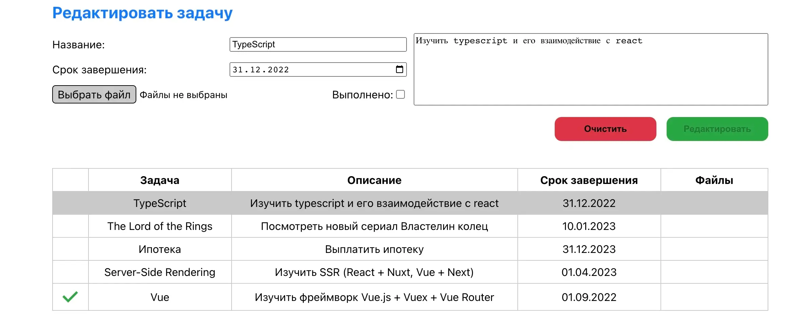

# Проект Todo list (тестовое задание)

[Ссылка на проект на Firebase](https://todo-list-dar-iva-7890.web.app/)

## Описание задания

Написать todo-лист.

### Функционал:

✔ создание, просмотр, редактирование (изменение полей или статус выполнения задачи), удаление задачи;  
✔ возможность прикрепления файлов к записи;  
✔ поля в задаче: заголовок, описание, дата завершения, прикрепленные файлы;  
✔ если дата завершения истекла или задача выполнена, это должно быть визуально отмечено.

— откомментировать код в JSDoc и выложить на gitlab.

### Обязательные технические требования:  
✔ использовать React;  
✔ использовать функциональные компоненты;  
✔ использовать хуки.

### Опциональные технические требования:
✔ использовать dayjs для работы с датами;  
— использовать firebase.google.com как Back-end;  
✔ использовать firebase.google.com или now.sh как хостинг клиенской части;  
✔ использовать less, если потребуется писать стили;  
✔ не использовать никаких библиотек, кроме необходимых для общения с backend.

### Стек:

* JS
* React
* HTML
* CSS, Less

## Директории

`/components` — компоненты приложения  
`/context` — глобальные стейты приложения    
`/hooks` - кастомные хуки приложения  
`/less` - общие стили приложения  
`/utils` - переиспользуемые функции, переменные    
`/images` - папка с изображениями    

## Установка зависимостей и запуск проекта

##### `npm i` – установить зависимости

##### `npm start` – запуск devServer на localhost

##### `npm build` – production сборка проекта